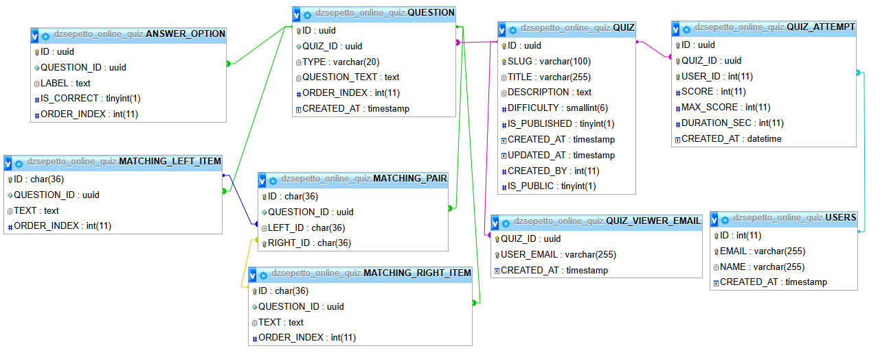

# 🎮 OnlineGames
[Online Games Website](https://www.dzsepetto.hu)

**OnlineGames** is a small open-source web project that collects simple, interactive browser-based games and quizzes in one place.  
The goal of the project is to experiment with game mechanics, quizzes, and modern web technologies while keeping the codebase clean and easy to understand.

This repository is also used as a learning and playground project for frontend development, API integration, and open-source collaboration.

---

## ✨ Features

- 🧠 Quiz-based games
- 👤 User-created quizzes
- ✏️ Edit & delete quizzes (owner only)
- 🔐 Authentication-aware UI
- ⚛️ Built with React & TypeScript
- 🌐 Designed for browser-based gameplay

---

## 🛠 Tech Stack

- **Frontend:** React + TypeScript
- **Routing:** React Router
- **State management:** React hooks
- **Styling:** CSS
- **Backend / API:** PHP based API

---

## 🗄 Database schema

